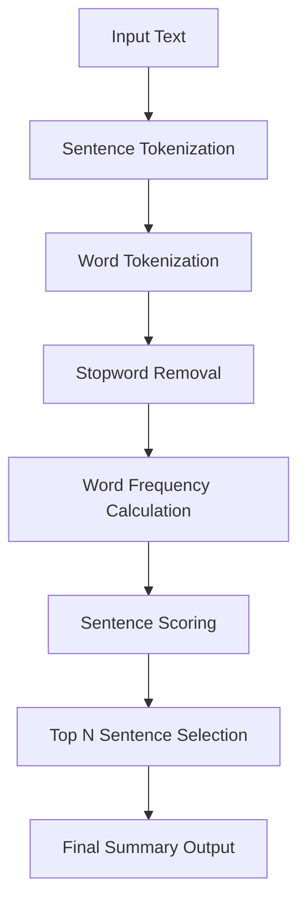

# Text Summarization with NLP  
An Extractive Summarization System Using Natural Language Processing

---

## Project Overview  
This project implements an extractive text summarization system using Natural Language Processing (NLP) techniques in Python. The application automatically identifies and extracts the most informative sentences from a given body of text, producing a concise and meaningful summary while preserving the original context and wording.

Unlike abstractive summarization, which generates new sentences, this system selects the most relevant sentences directly from the source text based on statistical and linguistic importance.

---

## Key Features  
- Accepts long-form text input such as articles, essays, documents, and reports  
- Intelligent sentence ranking using word frequency analysis  
- Automatic stopword removal for noise reduction  
- Fast and lightweight processing using NLTK  
- Preserves original sentence structure for clarity and accuracy  
- Customizable summary length  

---

## System Architecture and Workflow  



## How It Works  

### 1. Input Handling  
The system accepts raw text input from the user, which can be sourced from files, user input, or API calls.

### 2. Tokenization  
Using NLTK, the text is split into:  
- Sentences for summary selection  
- Words for frequency analysis  

### 3. Stopword Filtering  
Common, low-value words such as "the", "is", and "and" are removed to ensure the model focuses on meaningful content.

### 4. Word Frequency Analysis  
- Each word’s frequency is calculated  
- Frequencies are normalized to prevent bias toward longer sentences  

### 5. Sentence Scoring  
Each sentence is scored based on the cumulative importance of the words it contains.

### 6. Summary Generation  
The top `N` highest-scoring sentences are extracted and presented as the final summary.

---

## Tech Stack  

- **Programming Language:** Python  
- **Libraries Used:**  
  - `nltk` – Tokenization and stopword processing  
  - `heapq` – Efficient top sentence extraction  
  - `re` – Text preprocessing and cleanup  

---

## Installation and Setup  

### 1. Clone the Repository  
```bash
git clone https://github.com/your-username/text-summarization-nlp.git
cd text-summarization-nlp
```
### 2. Install Dependencies  
Run the following command:

    pip install nltk

### 3. Download Required NLTK Resources  
Open a Python shell and run:

    import nltk
    nltk.download("punkt")
    nltk.download("stopwords")

---

## Usage  

### Example  
    from summarizer import summarize_text

    text = """
    Natural Language Processing is a field of artificial intelligence that focuses on the interaction
    between computers and humans through natural language. It enables machines to read, understand,
    and derive meaning from human languages.
    """

    summary = summarize_text(text, num_sentences=2)
    print(summary)

### Sample Output  
    Natural Language Processing is a field of artificial intelligence that focuses on the interaction between computers and humans through natural language.
    It enables machines to read, understand, and derive meaning from human languages.

---

## Customization Options  

| Parameter         | Description                                   |
|-------------------|-----------------------------------------------|
| num_sentences    | Number of sentences to include in the summary |
| stopwords        | Modify or extend stopword list                |
| min_word_length | Filter very short or noisy tokens             |

---

## Use Cases  

- Academic paper summarization  
- News article condensation  
- Report highlights generation  
- NLP learning and experimentation  
- Data preprocessing for machine learning pipelines  

---

## Future Enhancements  

- Abstractive summarization using transformer-based models such as BERT, T5, or GPT  
- Web-based user interface using Flask or Streamlit  
- File upload support for PDF, DOCX, and TXT formats  
- Sentence importance visualization  
- Multi-language support  

---

## Contributing  

Contributions are welcome. To contribute:  
1. Fork the repository  
2. Create a feature branch  
3. Commit your changes  
4. Submit a pull request  

---

## License  

This project is licensed under the MIT License. You are free to use, modify, and distribute this software.
